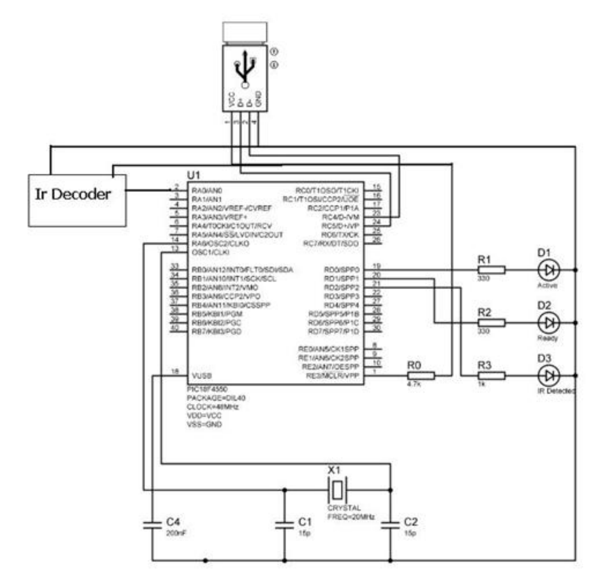

# Remote Device

## Tổng quan

- Đây là đồ án môn học năm 4, ĐHBKHN, môn Thiết bị ngoại vi
- Mình lưu lại ở đây coi như `cổ vật` cho mình 

## Bài toán 

- Làm thiết bị kết nối qua USB để hỗ trợ điều khiển máy tính chạy Windows với bất kỳ thiết bị hồng ngoại nào (điều khiển TV chẳng hạn)

## Lời giải

- Build mạch sử dụng dsPIC hỗ trợ USB interface
- Khử nhiễu hồng ngoại
- Viết ứng dụng Windows tương tác với HID driver

## Hình ảnh

Mạch 

Ứng dụng 

